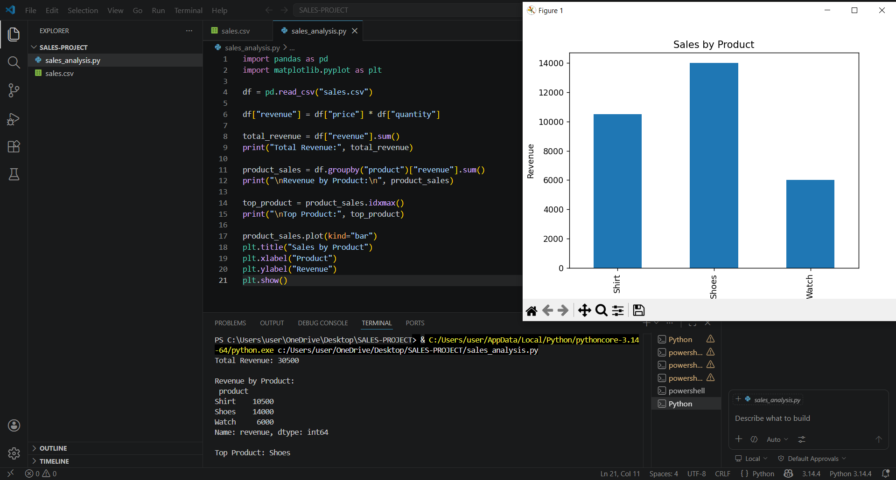

# sales-data-analyzer

A Python project that analyzes sales data and generates insights.

## 📊 Features
- Reads CSV data using pandas
- Calculates total revenue and product-wise performance
- Identifies top-performing product
- Visualizes results using matplotlib

## 🛠️ Tech Stack
- Python
- Pandas
- Matplotlib

## ▶️ How to Run
1. Install libraries:
   pip install pandas matplotlib
2. Run:
   python sales_analysis.py

## 📈 Output
- Console output showing revenue insights
- Bar chart visualization of product sales
## 📊 Sample Output

